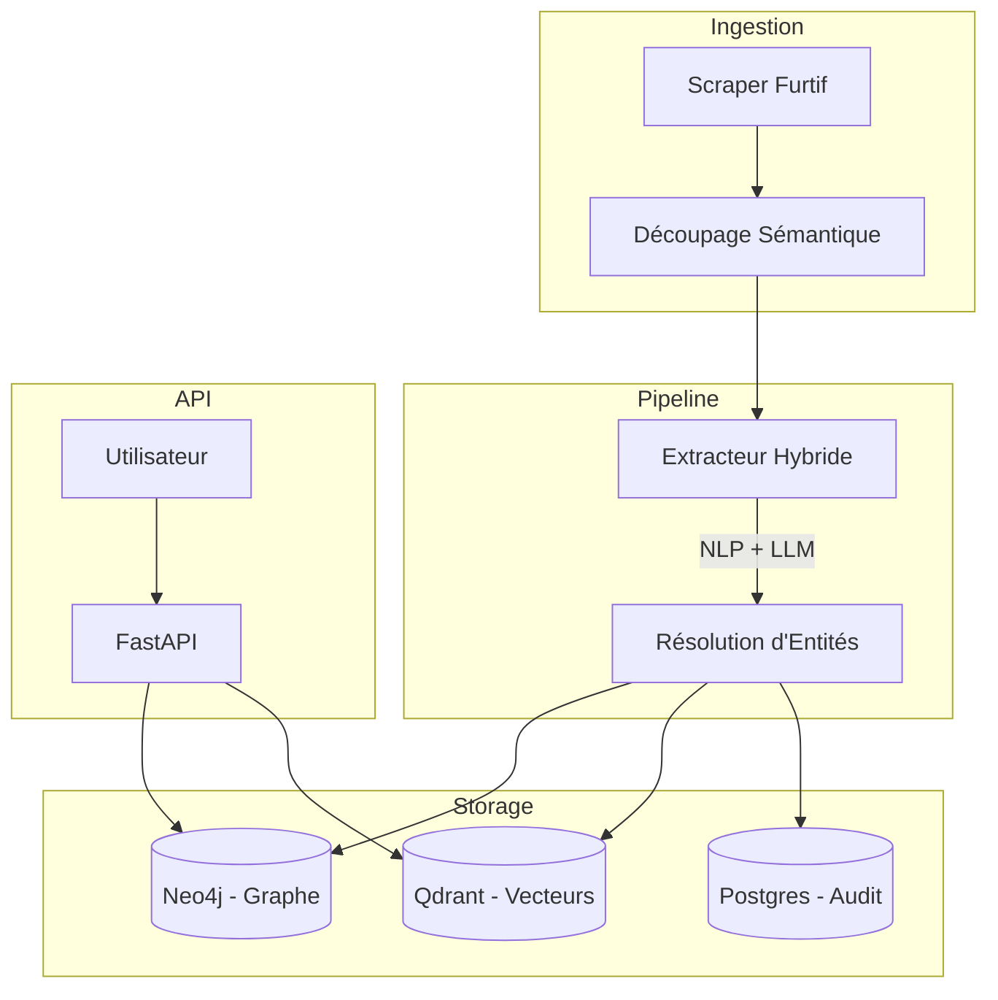

# ShadowMap


**Plateforme Avancée de Knowledge Graph OSINT**

*Une implémentation haute performance d'un pipeline OSINT orienté événements, explorant l'extraction hybride NLP/LLM et la persistance polyglotte.*

Ce projet démontre une architecture de niveau production pour transformer des données web non structurées en renseignement structuré.

## Fonctionnalités Clés

- **Ingestion Furtive** : Scraping automatisé avec techniques anti-détection avancées (Rotation d'User-Agent, Jitter aléatoire) et découpage sémantique (Chunking).
- **Intelligence Hybride** : Combine le NLP classique (SpaCy) pour la rapidité et les LLM (GPT-4) pour l'extraction de relations complexes.
- **Résolution d'Entités** : Déduplication vectorielle via Qdrant pour fusionner les entités à travers multiples documents.
- **Graphe de Connaissances** : Stockage Neo4j pour traverser des relations complexes (ex: "Personne X finance Organisation Y").
- **Architecture Robuste** : Conception orientée événements avec Celery, Redis, et une Dead Letter Queue (DLQ) "Fail-Closed" pour la fiabilité.
- **Accès API** : Endpoints FastAPI documentés pour l'ingestion et la recherche sémantique.

## Pré-requis

- Docker Engine 24+ & Docker Compose
- Python 3.11+
- Clé API OpenAI (ou fournisseur LLM compatible)

## Démarrage Rapide

### 1. Infrastructure
Lancer la couche de persistance (Neo4j, Postgres, Qdrant, Redis) :
```bash
docker-compose up -d
```
*Assurez-vous que les ports 7474, 7687, 6333, 5432, et 6379 sont disponibles.*

### 2. Configuration
Copier le modèle d'environnement :
```bash
cp .env.example .env
```
Éditez `.env` pour configurer votre fournisseur LLM et les accès bases de données.

### 3. Installation
```bash
pip install -r requirements.txt
```

## Utilisation

### Lancer l'API
```bash
uvicorn src.api.main:app --reload
```
Swagger UI : `http://localhost:8000/docs`

### Lancer le Worker
```bash
celery -A src.ingestion.tasks worker --loglevel=info
```

## Aperçu de l'Architecture

Le système suit une architecture événementielle :



1.  **Ingestion** : `src/ingestion/` - Scraping furtif & découpage sémantique.
2.  **Pipeline** : `src/pipeline/` - Extraction hybride (SpaCy + LLM) & Résolution d'Entités.
3.  **Stockage** : `src/storage/` - Persistance polyglotte (Graphe, Vecteur, Relationnel).
4.  **API** : `src/api/` - Endpoints REST.

## Développement

- **Intégration LLM** : L'extracteur est configuré par défaut en mode simulation pour le développement afin d'éviter la consommation d'API. Pour activer l'inférence réelle, mettez à jour `src/pipeline/extractor.py`.
- **Fail-Closed** : Le système est conçu pour arrêter les opérations en cas d'échec de stockage afin de garantir la cohérence des données.
